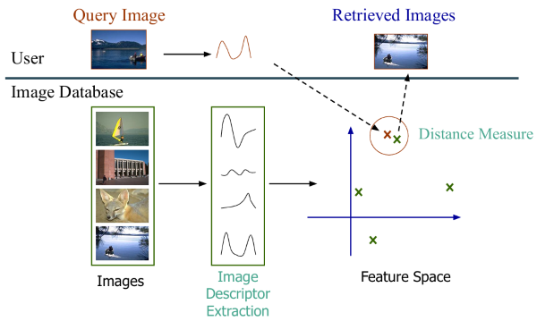

# MCV-C1 Project: Content Based Image Retrieval | Team3
## Project Description
This project contains all the code necessary to build an end-to-end image retrieval system. The system allows users to query images and retrieve the most visually similar results from a database using various feature extraction and distance functions.

The figure below illustrates the main idea:


## Project Organization
The project organitzation is the following:

```
Team3/
├── README.md                         <- Main project description and usage instructions
├── requirements.txt                  <- Python dependencies required to run the project
├── .gitignore                        <- Files and folders ignored by Git
│
├── config/                           <- Configuration files for the entire pipeline
│   ├── color_descriptors_config.py   <- Defines descriptor search space, grid configs, and mixed setups
│   ├── general_config.py             <- Global parameters to control the entire pipeline
│   └── io_config.py                  <- Input/output paths and directory structure used across modules
│
├── data/                             <- Datasets used for development, testing, and retrieval evaluation
│   ├── BBDD/                         <- Image database used as retrieval reference
│   ├── qsd1_w1/                      <- Query set for development phase
│   └── qst1_w1/                      <- Query set for testing phase
│
├── descriptors/                      <- Feature extraction modules
│   └── color_descriptors/            <- Implementation of color descriptors
│       ├── color_descriptors_func.py <- Functions to compute color descriptors and store histograms
│       └── stored_color_descriptors/ <- Precomputed descriptors saved as .txt files
│
├── exploratory_analysis/             <- Exploratory notebooks and visual analyses
│   └── dataset_analysis.ipynb        <- Sample visualizations
│
├── pipeline/                         <- Core pipeline scripts for descriptor computation and evaluation
│   ├── descriptor_creator.py         <- Generates and stores descriptors for all datasets
│   ├── dev_pipeline.py               <- Runs evaluation over development queries
│   └── test_pipeline.py              <- Runs final predictions and stores ranked retrieval results
│
├── results/                          <- Generated outputs, scores, and evaluation metrics
│   ├── histograms/                   <- Saved histogram visualizations
│   ├── method1/                      <- Results for the first retrieval configuration (in the test set)
│   │   └── result.pkl
│   ├── method2/                      <- Results for the second retrieval configuration (in the test set)
│   │   └── result.pkl
│   ├── dev_scores.csv                <- Summary table with metrics for all the descriptors and distances selected
│   ├── obtained_scores_k1.png        <- Plot showing mAP@1 performance for each descriptor-distance
│   └── obtained_scores_k5.png        <- Plot showing mAP@5 performance for each descriptor-distance
│
├── utils/                            <- Utility functions shared across modules
│   ├── common.py                     <- Helpers for file I/O, descriptor loading, and formatting
│   ├── logging_formater.py           <- Custom log formatting for debugging and reproducibility
│   ├── logging.ini                   <- Logging configuration file
│   └── metrics.py                    <- Implementation of distance functions
│
├── main.py                           <- Entry point to run descriptor generation, development, or test phases
```

## Instructions 
To run the code follow these instructions: 

**Clone the repository**

Clone the github repository by running the following command:

```bash
git clone https://github.com/MCV-2025-C1-Project/Team3.git
cd Team3
```

**Create virtual environment**

The next thing you will need is python3.12 or higher to create a virtual environment. There are several ways to do this but in our team we did the following steps. First you will need to create a virtual environment with the following command and run it.

```bash
python3 -m venv venv
source ./venv/bin/activate
```

**Install dependencies**

Once the virtual environment is active, install the required Python libraries listed in the requirements.txt file:
```bash
pip install -r requirements.txt
```
This command will install all dependencies necessary to run the entire pipeline.

**Create data folder**

As shown in the project structure diagram above, the data/ directory must exist at the root level of the repository.
Create it manually if it does not exist, and place the datasets inside following the expected structure:

```
data/
├── BBDD/
├── qsd1_w1/
└── qst1_w1/
```

If the folder names are different, they should be updated accordingly in io_config.py.

**Execute main**

Once the data structure is created, run the main file:
```bash
python main.py
```

**Seeing the results**

After this, you will have different outputs depending on the configurations. These can be found on:
- results/method1/result.pkl
- results/method2/result.pkl
- results/dev_score.csv
- results/obtained_scores_k1.png
- results/obtained_scores_k2.png
- descriptors/color_descriptors/stored_color_descriptors/*.txt

What these files contain is explained on the [Project Organization](#project-organization) section.

## How to use config files
**General Config File**

This file defines the main execution parameters that control which parts of the pipeline are executed and how the evaluation is performed.

Below is a short description of the main parameters:
- **PRECOMPUTE**:	If True, the system computes and stores image descriptors for the database. Set to False to reuse existing precomputed descriptors.
- **DEV_PREDICTION**:	If True, runs the validation pipeline to evaluate descriptors and metrics using the dev queries.
- **TEST_PREDICTION**:	If True, runs the test pipeline to generate retrieval results for the test queries.
- **TOP_K_TEST**:	Number of top-ranked images retrieved for each query in the test set.
- **K_VALUES**:	List of k values used for evaluation metrics such as mAP@1, mAP@5, etc.
- **DESCRIPTORS**:	List of descriptor families to use (e.g., "COLOR_DESCRIPTORS", "TEXTURE_DESCRIPTORS", etc.).
- **WANTED_DISTANCES**:	List of distance or similarity functions used to compare descriptors.

**IO Config File**

This file defines all input and output paths used across the project. Most of these paths are automatically managed by the pipeline and do not need to be modified.
However, there are two parameters that are relevant for the user when running experiments:

- **STORE_HISTOGRAMS**: If True, histogram visualizations for each image descriptor are generated and stored.
- **STORE_RESULTS_TXT_BY_DESCRIPTOR**: If True, a .txt file is generated for each descriptor, showing the top-5 most relevant retrieved images for every development query, along with their comparison to the ground truth. This option is useful for debugging and understanding retrieval behavior.

**Color Descriptors Config File**

This file defines all color descriptor configurations.
This configuration file is responsible for:

- Defining search spaces for color descriptors (color spaces, channels, bin sizes, and value ranges).

- Generating multiple descriptor configurations automatically using grid search.

- Combining multiple descriptors into mixed configurations (e.g., HSV + Lab).

- Selecting which descriptors to use in the precompute stage, evaluation stage and test stage (in the test stage only two methods should be added definig the name of the descriuptor + distance to use).

It is important to note that the name convention is: <color_space>_<channels>_bins<bin_values>_w<weights>


## Contact
- Gerard Asbert Marcos: gerardasbert@gmail.com
- Xavier Pacheco Bach: xavipba@gmail.com
- Mohammed Oussama Ammouri: am.oussama10@gmail.com
- Aleix Armero Rofes: aleix.armero73@gmail.com
